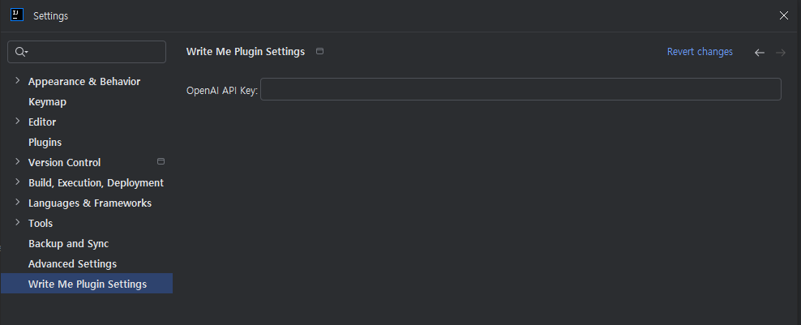

# Write Me ⚡️

**Write Me**는 OpenAI의 GPT 모델을 활용하여 코드 변경 사항(Git Diff)을 분석하고, 상황에 맞는 **커밋 메시지를 자동으로 생성해주는 인텔리제이(IntelliJ) 플러그인**입니다.

**Write Me** is an IntelliJ plugin that utilizes OpenAI's GPT models to analyze code changes (Git Diff) and **automatically generate appropriate commit messages**.

---

## 🇰🇷 한국어 (Korean)

### 🚀 주요 기능
* **AI 자동 분석:** 변경된 코드의 내용을 AI가 분석하여 문맥을 파악합니다.
* **원클릭 생성:** 커밋 창에서 버튼 하나만 누르면 메시지가 작성됩니다.
* **다국어 지원:** 한국어로 자연스러운 커밋 메시지를 생성합니다.

### ⚙️ 설정 방법 (Configuration)
플러그인을 사용하기 위해서는 **OpenAI API Key**가 필요합니다.

1.  IntelliJ 상단 메뉴에서 **Settings** (Mac: `Preferences`)를 엽니다. (`Ctrl` + `Alt` + `S` / `Cmd` + `,`)
2.  좌측 메뉴 목록에서 **Write Me**를 찾습니다.
3.  **OpenAI API Key** 입력란에 발급받은 키(sk-...)를 붙여넣고 `Apply`를 누릅니다.

> 
> *(설정 화면 예시)*

### 📝 사용 방법 (Usage)
1.  Git 커밋 창을 엽니다. (`Alt` + `0` 또는 `Cmd` + `K`)
2.  Stage에 커밋할 파일들을 체크합니다.
3.  커밋 메시지 입력란 상단 툴바에 있는 **⚡️ (Generate Commit Message)** 아이콘을 클릭합니다.
4.  AI가 분석한 커밋 메시지가 자동으로 입력됩니다.

---

## 🇺🇸 English

### 🚀 Features
* **Context-Aware Analysis:** Automatically analyzes the context of your code changes (Git Diff) to understand the intent.
* **One-Click Generation:** Generate commit messages with a single click directly inside the Commit window.
* **Smart Summaries:** Generates concise, meaningful, and ready-to-use commit messages.

### ⚙️ Configuration
You need a valid **OpenAI API Key** to use this plugin.

1.  Open **Settings** (Windows/Linux) or **Settings / Preferences** (macOS) in IntelliJ. (`Ctrl` + `Alt` + `S` / `Cmd` + `,`)
2.  Navigate to **Tools** > **Write Me** in the left-hand menu. (If it's under Tools)
    * *If it's at the root level, just use:* Find **Write Me** in the left-hand menu.
3.  Enter your **OpenAI API Key** (starting with `sk-...`) and click `Apply`.

> 
> *(Settings Screen Example)*

### 📝 Usage
1.  Open the **Commit** tool window (`Alt` + `0` or `Cmd` + `K`).
2.  Select the files you want to include in the commit.
3.  Click the **⚡️ (Generate Commit Message)** icon located on the commit toolbar.
4.  The AI-generated message will be automatically populated in the input field.

### 🛠 Tech Stack
* **JDK:** 17+
* **Platform:** IntelliJ Platform SDK
* **API:** OpenAI GPT-4 / GPT-3.5

## 📄 License
This project is licensed under the Apache 2.0 License - see the [LICENSE](LICENSE) file for details.